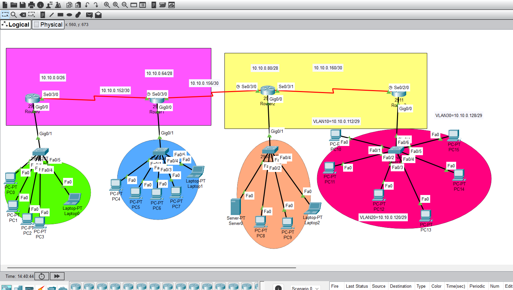
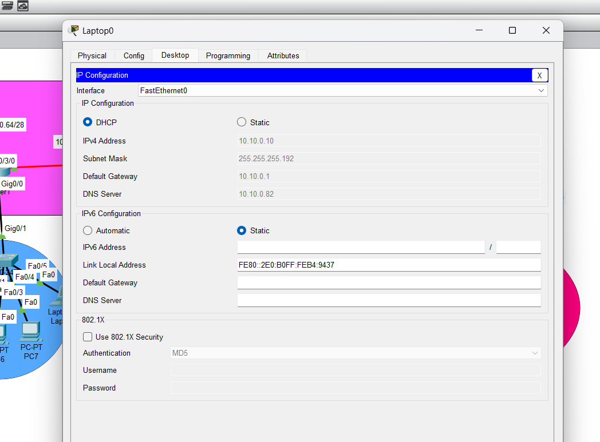
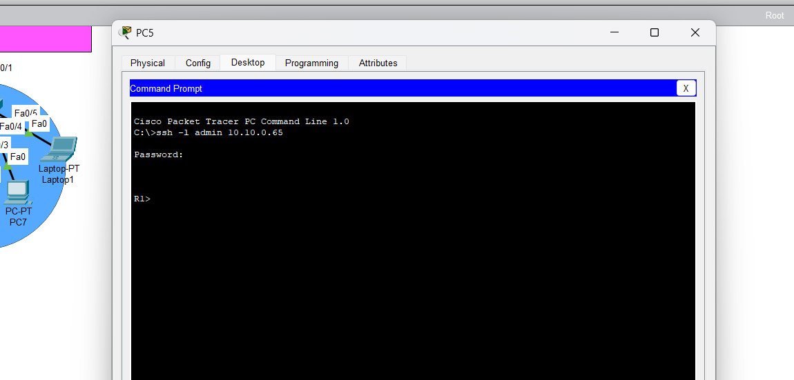
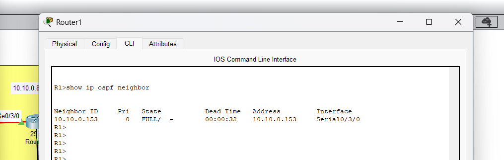
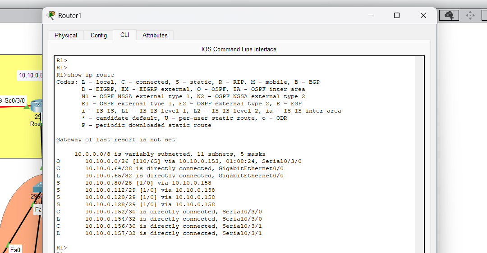
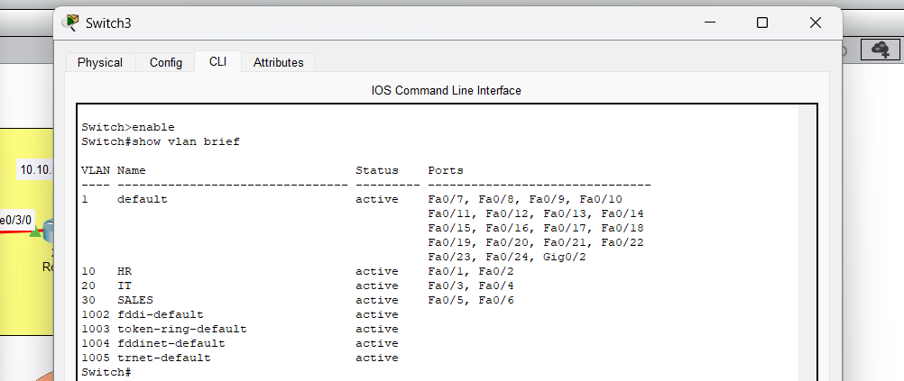
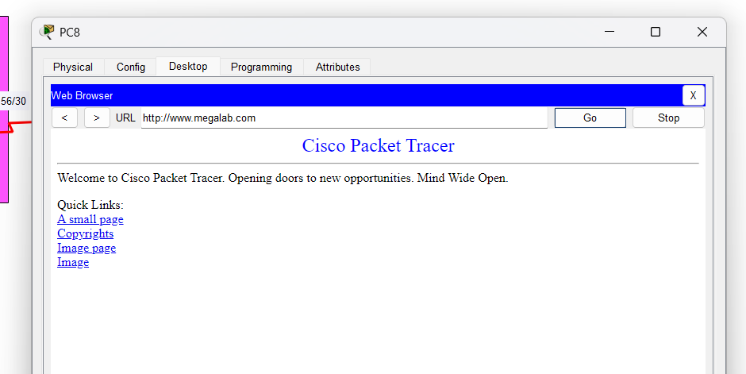

# SOC Diploma Networking Project

> A Cisco Packet Tracer enterprise networking lab completed as part of my SOC Analyst diploma.

## Overview

This accepted hands-on project demonstrates the networking foundations that support effective security monitoring and SOC analysis. The topology connects four routers and multiple LAN segments, combining dynamic and static routing with core network services and segmentation.

> The original Packet Tracer topology and configuration are preserved exactly as accepted.

## Technologies and concepts

- Cisco Packet Tracer and Cisco IOS
- Four-router enterprise topology
- IPv4 addressing with VLSM
- Static routing and OSPF Area 0
- DHCP address assignment
- SSH for secure remote administration
- DNS resolution and HTTP service access
- VLAN 10, VLAN 20, and VLAN 30 segmentation

## SOC and cybersecurity relevance

Network visibility starts with understanding normal traffic paths, address allocation, routing, services, and segmentation. This lab connects those foundations to SOC work: DHCP and DNS logs provide valuable investigation context, SSH represents secure administrative access, and VLAN boundaries help reduce unnecessary lateral communication.

## Network design

The lab uses four routers joined by point-to-point links and VLSM subnetting. Static routes are configured on one side of the topology, while the other uses OSPF Area 0. The design includes separate LANs for DHCP, SSH management, DNS/HTTP services, and three VLANs.



## Documentation

- [IP addressing and VLSM](IP-Addressing.md)
- [Routing and OSPF](Routing.md)
- [Network services](Network-Services.md)
- [VLAN segmentation](VLANs.md)

## Verification evidence

The included screenshots document successful service and routing checks:

| Area | Evidence |
| --- | --- |
| DHCP | Client receives network settings automatically |
| SSH | Secure remote router access |
| OSPF | Area 0 neighbor state |
| Routing | Static, OSPF, connected, and VLSM routes |
| VLANs | VLAN 10/20/30 and switch port assignments |
| DNS and HTTP | Website access through DNS name resolution |

### DHCP


### SSH


### OSPF


### Routing


### VLANs


### DNS and HTTP


## Project file

Open [Kareem_mousa_final.pkt](Packet-Tracer/Kareem_mousa_final.pkt) with Cisco Packet Tracer to view the accepted topology and configuration.

## Verification commands

```text
show ip route
show ip ospf neighbor
show vlan brief
show ip interface brief
ping
traceroute
```

